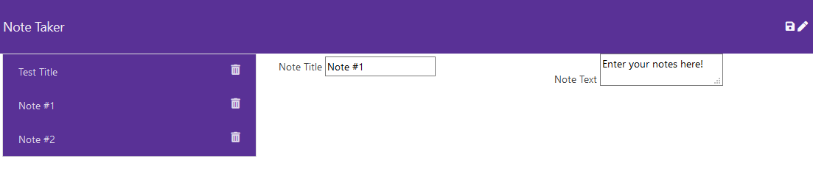

# Note Taker

## About

The Note Taker application is a browser-based app that uses a Node server to store notes indefinitely for a user! The server listens for the user to make a request, most commonly in the form of retrieving ('get') notes from the server, and writing ('post') new notes to the server. The user can reload the page at any time to get previously stored notes, and they can also click the trash icon to delete any unwanted notes. 

## Screenshots

The user is greeted with a clean landing page.

__________________________________________________________________________________

After clicking the 'Get Started' button, the user is sent to the app page. The interface has a note title and text field, a save button to save entries from those fields, a clear button to clear the fields, and a list of previously saved notes. The saved notes each have a trash icon, which can be clicked to delete that particular entry.

Clicking on a old note from the list will fill the title and text fields with that note's particular data.

And clicking the trash icon will get rid of any old or unwanted notes!

## Technology

- NodeJS
- Express

## Links

- https://note-taker-nk.herokuapp.com/
- https://github.com/marauder30/note-taker

## Author

[Nicholas Koch](https://marauder30.github.io/portfolio)